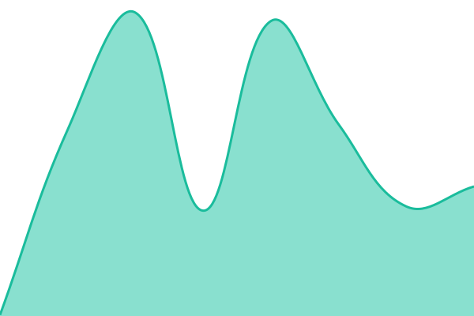

# [📈 Live Status](https://status.thudep.com): <!--live status--> **🟩 All systems operational**

This repository contains the open-source uptime monitor and status page for [清华大学工物科协](https://status.thudep.com), powered by [Upptime](https://github.com/upptime/upptime).

With [Upptime](https://upptime.js.org), you can get your own unlimited and free uptime monitor and status page, powered entirely by a GitHub repository. We use [Issues](https://github.com/thudep/upptime/issues) as incident reports, [Actions](https://github.com/thudep/upptime/actions) as uptime monitors, and [Pages](https://status.thudep.com) for the status page.

<!--start: status pages-->
<!-- This summary is generated by Upptime (https://github.com/upptime/upptime) -->
<!-- Do not edit this manually, your changes will be overwritten -->
<!-- prettier-ignore -->
| URL | Status | History | Response Time | Uptime |
| --- | ------ | ------- | ------------- | ------ |
|  [Ghost Hunter homepage](https://ghosthunter.thudep.com) | 🟩 Up | [ghost-hunter-homepage.yml](https://github.com/thudep/upptime/commits/HEAD/history/ghost-hunter-homepage.yml) | 

 177ms
     
 | 

<a href="https://status.thudep.com/history/ghost-hunter-homepage">100.00%</a>
    

|  [Ghost Hunter gitea](https://ghgit.thudep.com) | 🟩 Up | [ghost-hunter-gitea.yml](https://github.com/thudep/upptime/commits/HEAD/history/ghost-hunter-gitea.yml) | 

 686ms
     
 | 

<a href="https://status.thudep.com/history/ghost-hunter-gitea">100.00%</a>
    

|  [Ghost Hunter fileserver](https://ghfile.thudep.com:7200) | 🟩 Up | [ghost-hunter-fileserver.yml](https://github.com/thudep/upptime/commits/HEAD/history/ghost-hunter-fileserver.yml) | 

 1076ms
     
 | 

<a href="https://status.thudep.com/history/ghost-hunter-fileserver">100.00%</a>
    

|  [Ghost Hunter Leaderboard](https://gh-leaderboard.thudep.com) | 🟩 Up | [ghost-hunter-leaderboard.yml](https://github.com/thudep/upptime/commits/HEAD/history/ghost-hunter-leaderboard.yml) | 

 582ms
     
 | 

<a href="https://status.thudep.com/history/ghost-hunter-leaderboard">94.02%</a>
    

|  [C Language Contest homepage](https://clang.thudep.com) | 🟩 Up | [c-language-contest-homepage.yml](https://github.com/thudep/upptime/commits/HEAD/history/c-language-contest-homepage.yml) | 

 173ms
     
 | 

<a href="https://status.thudep.com/history/c-language-contest-homepage">100.00%</a>
    

|  [Pastebin](https://bin.thudep.com) | 🟩 Up | [pastebin.yml](https://github.com/thudep/upptime/commits/HEAD/history/pastebin.yml) | 

 177ms
     
 | 

<a href="https://status.thudep.com/history/pastebin">100.00%</a>
    

|  [C Language Contest fileserver](https://cfile.thudep.com:7100) | 🟩 Up | [c-language-contest-fileserver.yml](https://github.com/thudep/upptime/commits/HEAD/history/c-language-contest-fileserver.yml) | 

 1090ms
     
 | 

<a href="https://status.thudep.com/history/c-language-contest-fileserver">100.00%</a>
    

|  [Medical Physics Challenge homepage](https://mpc.thudep.com) | 🟩 Up | [medical-physics-challenge-homepage.yml](https://github.com/thudep/upptime/commits/HEAD/history/medical-physics-challenge-homepage.yml) | 

 132ms
     
 | 

<a href="https://status.thudep.com/history/medical-physics-challenge-homepage">100.00%</a>
    

|  [Medical Physics Challenge fileserver](https://mpcfile.thudep.com:7300) | 🟩 Up | [medical-physics-challenge-fileserver.yml](https://github.com/thudep/upptime/commits/HEAD/history/medical-physics-challenge-fileserver.yml) | 

 1083ms
     
 | 

<a href="https://status.thudep.com/history/medical-physics-challenge-fileserver">100.00%</a>
    

|  [Hedgedoc](https://doc.thudep.com) | 🟩 Up | [hedgedoc.yml](https://github.com/thudep/upptime/commits/HEAD/history/hedgedoc.yml) | 

 689ms
     
 | 

<a href="https://status.thudep.com/history/hedgedoc">94.02%</a>
    

<!--end: status pages-->

[**Visit our status website →**](https://status.thudep.com)

## 📄 License

- Powered by: [Upptime](https://github.com/upptime/upptime)
- Code: [MIT](./LICENSE) © [Anand Chowdhary](https://anandchowdhary.com), supported by [Pabio](https://pabio.com)
- Data in the `./history` directory: [Open Database License](https://opendatacommons.org/licenses/odbl/1-0/)
